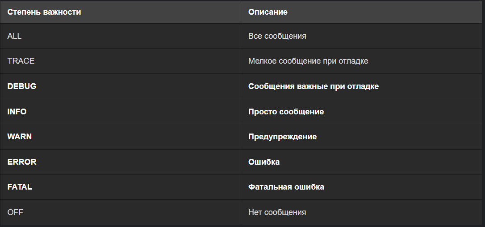
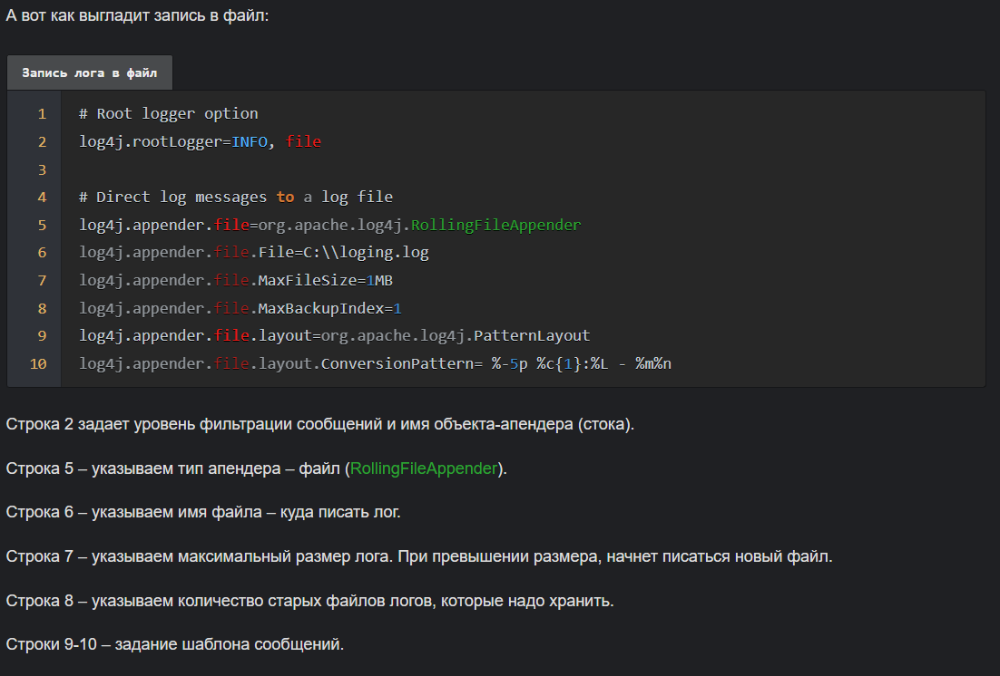

# Логирование в Java
В Java есть свой логгер, но чаще всего используется `log4j` или, написанный на его основе, `slf4j`.
Лог за день может занимать в памяти до нескольких гигабайт. При этом чаще всего настроена его
автоматическая архивация с указанием даты, за которую этот лог отвечает.

## Как работает логирование и что логировать
Чаще всего почти в каждом классе программы присутствует `static` поле с логгером.
Информация в логе делится по уровням важности.
Уровни важности информации в логе:

В настройках можно указать минимальный уровень отображаемой в логе информации. Например, `ERROR` - 
тогда все сообщения уровней `WARN`, `INFO`, `DEBUG` и `TRACE` будут отброшены.

## Настройка логирования
Обычно настройки логгера `log4j` задаются в файле `log4j.properties`.  
Пример файла настроек для логирования в файл

