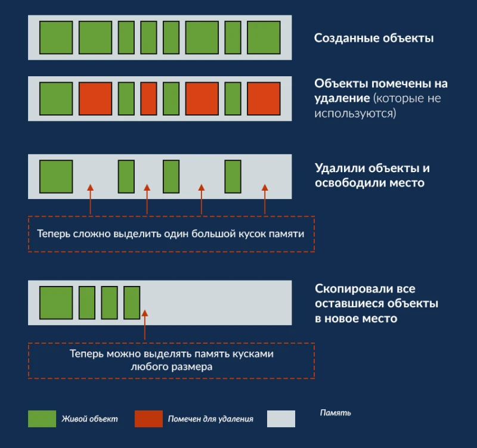

# Работа памяти в Java
## Схема памяти
Память в Java, грубо говоря, разделена на две части. В первой хранятся все объекты, а вторая нужна, 
чтобы копировать туда "живые" объекты при сборке мусора. При этом "не живые" останутся в первой части и 
первая часть будет очищена. После этого, формально, первая часть станет второй, а вторая - первой.

## Живой/не живой
Объект считается достижимым (живым), если на него ссылается другой достижимый (живой) объект. Достижимость
считается от нитей. Работающие нити всегда считаются достижимыми (живыми), даже если на них никто не ссылается.

## Garbage Collector
Сборщик мусора в Java работает сам по себе. Вызывается и чистит память так, как сам считает нужным. Можно
вызвать его с помощью `System.gc()`, но это не гарантирует, что после вызова обязательно начнется сборка мусора.

## Виды ссылок в Java
В отличие от прямых (сильных, `StrongReference`) ссылок существуют еще:
1) `SoftReference` – мягкая ссылка. 
При нехватке памяти (перед тем как выбросить `OutOfMemory`) все объекты, на которые есть только мягкие ссылки
будут удалены. `WeakReference` и `PhantomReference` считаются еще менее слабыми, чем "мягкие" ссылки.
2) `WeakReference` – слабая ссылка.
При следующей очистке памяти GarbageCollector'ом все объекты, на которые есть только слабые ссылки, будут удалены.
При этом до очистки с ними можно будет делать все то же самое, что и с обычными объектами.
3) `PhantomReference` – призрачная ссылка.
При следующей очистке памяти GarbageCollector'ом к объектам, на которые из ссылок остались только призрачные, 
будет применен следующий алгоритм действий:
   1) Если у объекта переопределен метод `finalize()`, то он будет вызван, иначе - этот шаг будет пропущен
   2) Во время следующей сборки мусора, объект будет помещен в специальную очередь призрачных объектов, 
   из которой будет удален, когда у PhantomReference вызовут метод clear()

## Больше по теме
[Статья на Хабре](https://habr.com/ru/company/otus/blog/553996/)