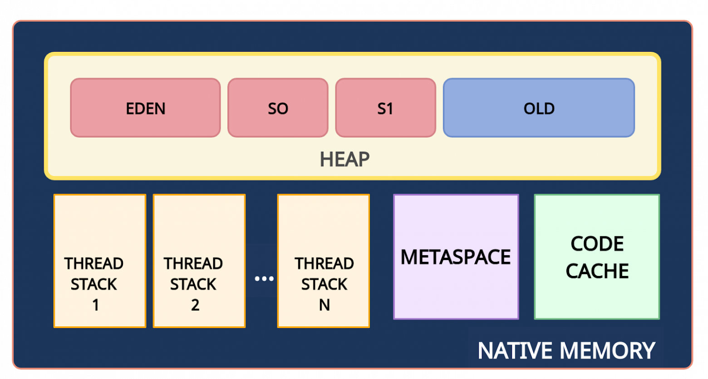
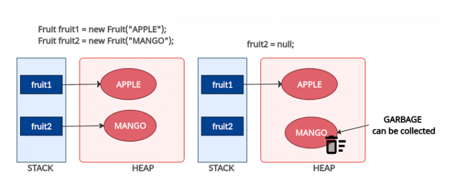
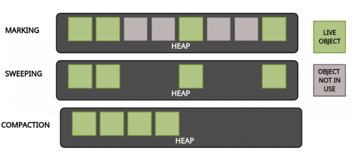
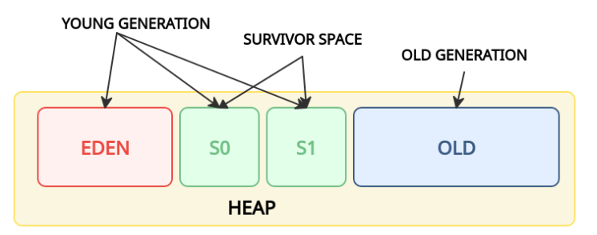

# Работа памяти в Java
## Схема памяти
### Структура памяти в целом
Память в Java состоит из следующих областей:

1) **Native Memory** — вся доступная системная память.
2) **Heap (куча)** — часть native memory, выделенная для кучи. Здесь JVM хранит объекты. 
Это общее пространство для всех потоков приложения.
3) **Stack (стек)** — используется для хранения локальных переменных и стека вызовов метода.
Для каждого потока выделяется свой стек.
4) **Metaspace (метаданные)** — в этой памяти хранятся метаданные классов и статические переменные.
Это пространство также является общими для всех. Так как metaspace является частью native memory, 
то его размер зависит от платформы.
5) **CodeCache (кэш кода)** — JIT-компилятор компилирует часто исполняемый код, преобразует его в нативный 
машинный код и кеширует для более быстрого выполнения. Это тоже часть native memory.

## Живой/не живой
Объект считается достижимым (живым), если на него ссылается другой достижимый (живой) объект. Достижимость
считается от нитей. Работающие нити всегда считаются достижимыми (живыми), даже если на них никто не ссылается.

## Garbage Collector
Сборщик мусора в Java работает сам по себе. Вызывается и чистит память так, как сам считает нужным. Можно
вызвать его с помощью `System.gc()`, но это не гарантирует, что после вызова обязательно начнется сборка мусора.

## Виды ссылок в Java
В отличие от прямых (сильных, `StrongReference`) ссылок существуют еще:
1) `SoftReference` – мягкая ссылка. 
При нехватке памяти (перед тем как выбросить `OutOfMemory`) все объекты, на которые есть только мягкие ссылки
будут удалены. `WeakReference` и `PhantomReference` считаются еще менее слабыми, чем "мягкие" ссылки.
2) `WeakReference` – слабая ссылка.
При следующей очистке памяти GarbageCollector'ом все объекты, на которые есть только слабые ссылки, будут удалены.
При этом до очистки с ними можно будет делать все то же самое, что и с обычными объектами.
3) `PhantomReference` – призрачная ссылка.
При следующей очистке памяти GarbageCollector'ом к объектам, на которые из ссылок остались только призрачные, 
будет применен следующий алгоритм действий:
   1) Если у объекта переопределен метод `finalize()`, то он будет вызван, иначе - этот шаг будет пропущен
   2) Во время следующей сборки мусора, объект будет помещен в специальную очередь призрачных объектов, 
   из которой будет удален, когда у PhantomReference вызовут метод clear()

## Сборка мусора
### Что такое "мусор"?
Мусором считается объект, который больше не может быть достигнут по ссылке из какого-либо объекта. 
Поскольку такие объекты больше не используются в приложении, то их можно удалить из памяти.

### Как это работает
Для сборки мусора используется алгоритм пометок. Он состоит из трех этапов:
1) **Mark (маркировка)**.  
На первом этапе GC сканирует все объекты и помечает живые (объекты, которые все еще используются). 
На этом шаге выполнение программы приостанавливается. Поэтому этот шаг также называется "Stop the World".
2) **Sweep (очистка)**.  
На этом шаге освобождается память, занятая объектами, не отмеченными на предыдущем шаге.
3) **Compact (уплотнение)**.  
Объекты, пережившие очистку, перемещаются в единый непрерывный блок памяти. Это уменьшает 
фрагментацию кучи и позволяет проще и быстрее размещать новые объекты.

### Поколения объектов
#### Что такое поколения объектов?
Для оптимизации сборки мусора память кучи дополнительно разделена на четыре области. 
В эти области объекты помещаются в зависимости от их возраста (как долго они используются в приложении).

1) **Young Generation (молодое поколение)**.  
Здесь создаются новые объекты. Область young generation разделена на три части раздела: 
Eden (Эдем), S0 и S1 (Survivor Space — область для выживших).
2) **Old Generation (старое поколение)**.  
Здесь хранятся давно живущие объекты.

## Более подробно про сборку мусора в Java
Статья на [Хабре](https://habr.com/ru/company/otus/blog/553996/)
