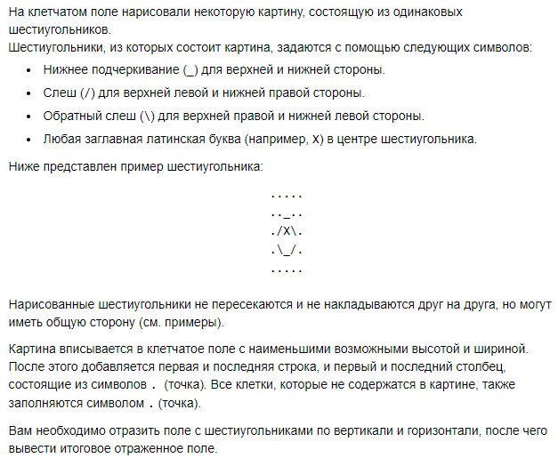
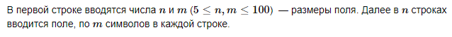
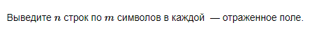
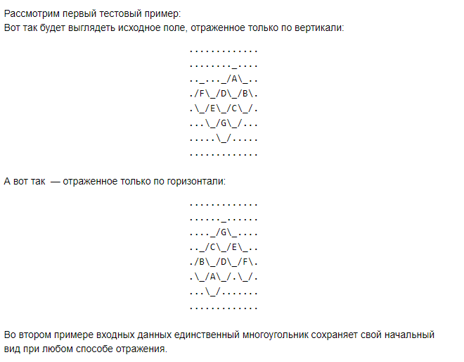

# B. Шестиугольники


## Формат ввода


## Формат вывода


## Пример 1
### Ввод
``` 
8 13
.............
...._........
.._/A\_..._..
./B\_/D\_/F\.
.\_/C\_/E\_/.
...\_/G\_/...
.....\_/.....
.............

```

### Вывод
```
.............
......_......
...._/G\_....
.._/E\_/C\_..
./F\_/D\_/B\.
.\_/.\_/A\_/.
.......\_/...
.............

```

## Пример 1
### Ввод
``` 
5 5
.....
.._..
./X\.
.\_/.
.....

```

### Вывод
```
.....
.._..
./X\.
.\_/.
.....

```

## Примечания

