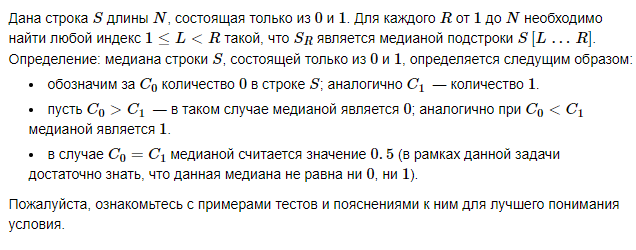
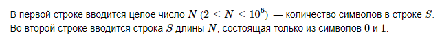
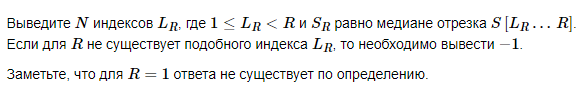
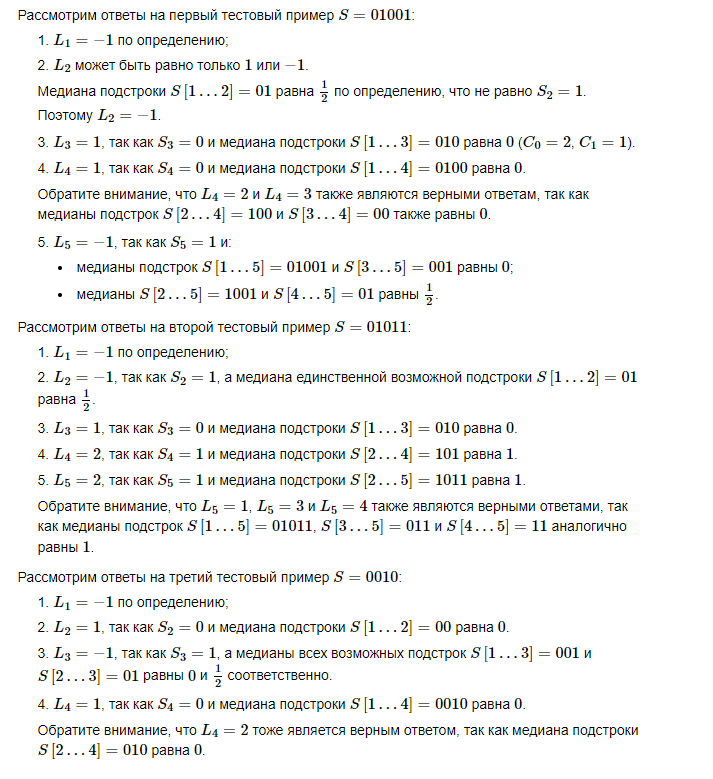

# D. Двоичная медиана


## Формат ввода


## Формат вывода


## Пример 1
### Ввод
``` 
5
01001

```

### Вывод
```
-1 -1 1 1 -1 

```

## Пример 2
### Ввод
``` 
5
01011

```

### Вывод
```
-1 -1 1 2 2 

```

## Пример 3
### Ввод
``` 
4
0010

```

### Вывод
```
-1 1 -1 1 

```

## Примечания

