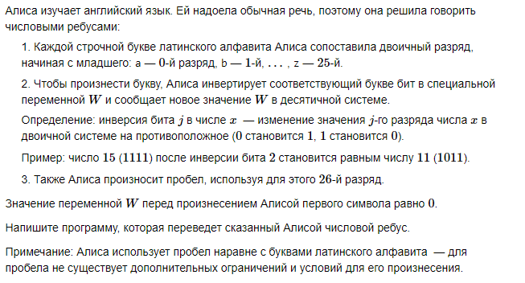
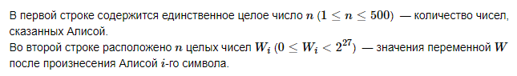
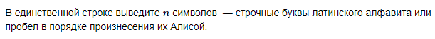

# A. Числовые ребусы


## Формат ввода


## Формат вывода


## Пример 1
### Ввод
``` 
5
1 2049 2305 2309 2325

```

### Вывод
```
alice

```

## Пример 2
### Ввод
``` 
3
1 3 2

```

### Вывод
```
aba

```

## Пример 3
### Ввод
``` 
12
4 132 148 262292 262164 262420 393492 393476 67502340 67502336 67502337 68026625

```

### Вывод
```
cheshire cat

```
