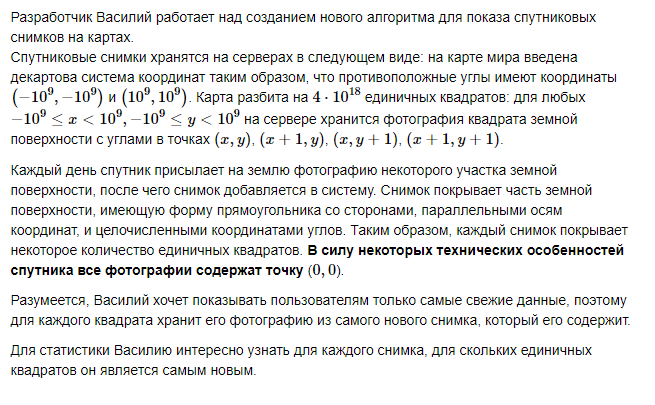
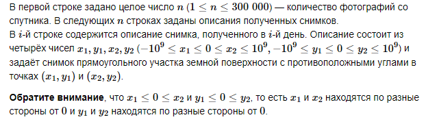
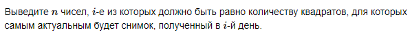
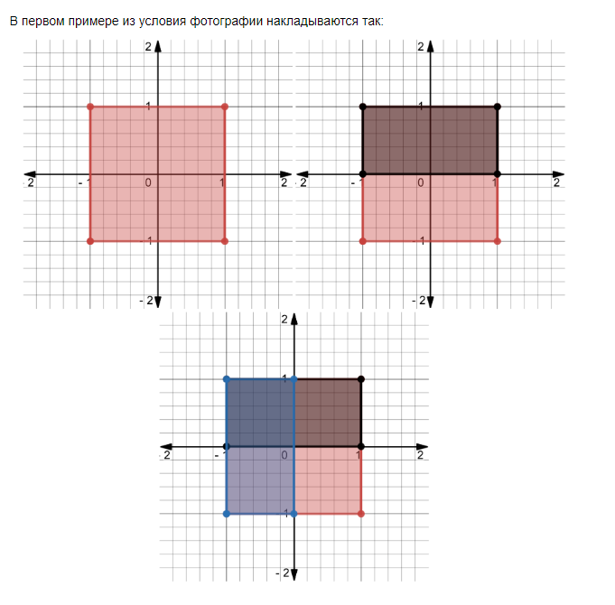

# F. Спутниковая съёмка


## Формат ввода


### Доступные ответы системы:


## Формат вывода


## Пример 1
### Ввод
```
3
-1 -1 1 1
-1 0 1 1
-1 -1 0 1

```

### Вывод
```
1
1
2

```

## Пример 2
### Ввод
```
4
-3 -3 3 3
0 0 0 0
-5 0 4 0
-1 -4 1 3

```

### Вывод
```
24
0
0
14

```

## Примечания

