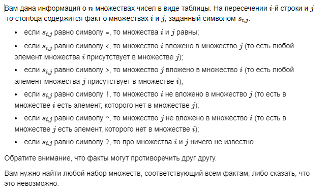
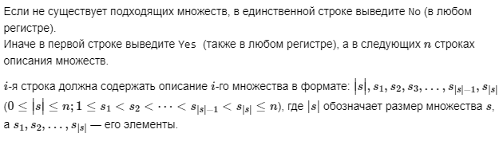
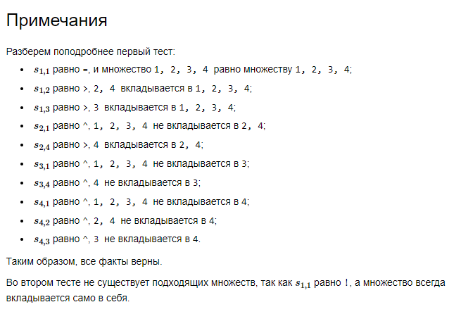

# E. Множества


## Формат ввода


## Формат вывода


## Пример 1
### Ввод
```
4
=>>?
^??>
^??^
^^^?

```

### Вывод
```
Yes
4 1 2 3 4
2 2 4
1 3
1 4

```

## Пример 2
### Ввод
```
2
!?
?=

```

### Вывод
```
No

```

## Примечания

