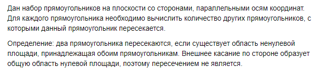
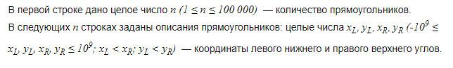
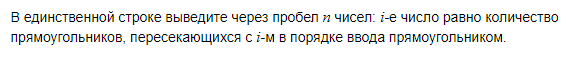

# E. Пересечения прямоугольников


## Формат ввода


## Формат вывода


## Пример 1
### Ввод
``` 
6
-2 -4 2 2
-2 -4 0 -1
-2 -1 0 2
0 -4 2 -1
0 -1 2 2
-1 -2 1 0

```

### Вывод
```
5 2 2 2 2 5 

```
