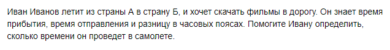
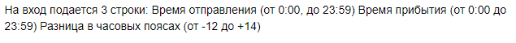
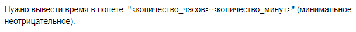

# B. Перелет


## Формат ввода


## Формат вывода


## Пример 1
### Ввод
```
12:00
13:05
0
```
### Вывод
```
1:05
```

## Пример 2
### Ввод
```
12:00
13:00
0
```
### Вывод
```
1:00
```

## Пример 3
### Ввод
```
0:00
6:25
0
```
### Вывод
```
6:25
```

## Пример 4
### Ввод
```
1:00
12:50
0
```
### Вывод
```
11:50
```
