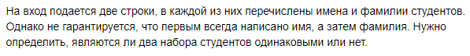
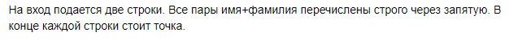
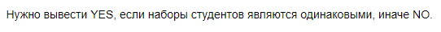

# C. Имена и фамилии


## Формат ввода


## Формат вывода


## Пример 1
### Ввод
```
Иван Петров, Иванов Петр.
Петр Иванов, Иван Петров.
```
### Вывод
```
YES
```

## Пример 2
### Ввод
```
Иван Петров, Иванов Петр.
Иван Петров, Максим Сидоров.
```
### Вывод
```
NO
```