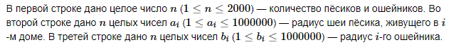

# B. Ошейники и песики
На кольцевой улице города живут n пёсиков. Их дома нумеруются по часовой стрелке. Новый закон обязывает каждого пёсика получить ошейник.
Для ускорения раздачи ошейники решили развезти на машине по кольцевой улице. Ошейники можно доставать только по очереди, машина не поедет на второй круг, она едет только по часовой стрелке. При этом машина может начать объезд из любой точки улицы.
Если радиус ошейника меньше радиуса шеи пёсика, то ему разрешается не носить ошейник, неудовлетворённость пёсика равна 0 . Если радиус ошейника больше радиуса шеи не более чем на 100 см, то неудовлетворённость пёсика равна разнице радиусов, разделённая на два (округлённая вниз). В других случаях ошейник болтается, пёсику неудобно, так что его неудовлетворённость равна 30. Ошейники уже запакованы в машину, а вы знаете радиусы шеи пёсиков. Нужно так выбрать место для начала объезда, чтобы суммарная неудовлетворённость была минимальна.

## Формат ввода


## Формат вывода
В единственной строке выведите два числа: с какого дома надо начать объезд, и минимальную суммарную неудовлетворенность. Если существует несколько оптимальных вариантов, выведите тот, в котором номер стартового дома минимален.

## Пример
### Ввод
```
1
2
5

```
### Вывод
```
1 1

```